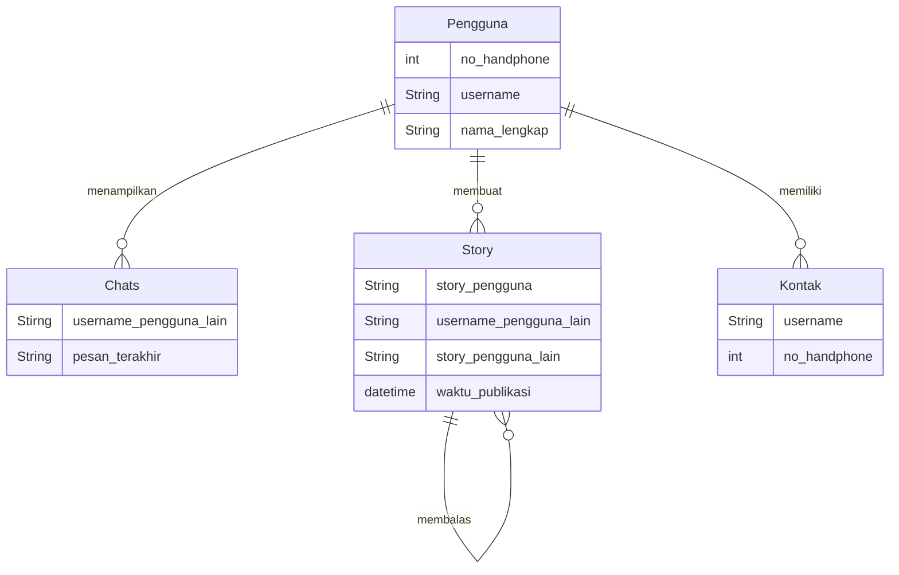
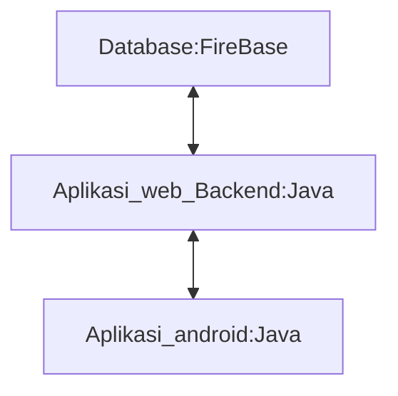

Membuat aplikasi Chat

## 1.1 Latar Belakang

Saat ini perkembangan teknologi begitu pesat terutama internet, dengan adanya internet kita dapat melakukan banyak haln diantaranya kita dapat mengirim sebuah pesan menggunakan aplikasi chat messenger atau instant messenger atau yang biasa disebut chatting, yaitu suatu teknologi jaringan yang dapat membantu penggunanya mengirimkan pesan secara realtime ke pengguna lain yang tersambung dalam sebuah jaringan dengan waktu yang begitu cepat. Maka dari itu saya ingin mencoba membuat sebuah aplikasi chat yang dapat memudahkan pengguna untuk berkomunikasi dengan cepat dan nyaman.

## 1.2. Deksripsi Teknologi Informasi

Aplikasi yang akan saya buat yaitu sebuah aplikasi chat yang akan diberi nama MrChat yang mana nanti pengguna dapat berkominisai dengan mengirim atau menerima chat atau dapat juga melakukan panggilan, dan pengguna juga dapat melihat atau mengirim status berupa image, video, atau cuitan, serta pengguna dapat mencari teman yang berada disekitarnya. 

## 1.3. Branding

Branding dari aplikasi yang akan saya buat meliputi:

Merk : MrChat
Nama merk "Mr" di ambil dari inisial nama saya sendiri yaitu "Muhammad Ridwan Nur Ihsan" yang diambil 2 huruf depan nama saya, dan dapat diartikan juga semagai "Tuan" yang diambil dari bahasa Inggris 

Tagline: Agar silaturammi tidak terputus, komunikasi lah terus menerus

Campaign: Bagaimana membuat aplikasi untuk penggunanya yang dapat berkomunikasi dengan mudah, simpel, dan yang pasti silaturahmi tidak akan putus walau tanpa meminjam seratus

Target user: Usia 7+
- Seorang yang sering bekomunikasi dengan siapaun
- Seorang yang tidak ingin silaturahminya terputus
- Seorang yang ingin berkomusikasi dengan mudah

User experience theme:
- Mudah
- Sederhana
- Menyenangkan
- Warna: dark blue yang tidak akan membuat mata cepat lelah

## 2. User Story

Sebagai | Yang dapat dilakukan | sehingga | Priorotas
---|---|---|---
Pengguna | Mengirim pesan | Dapat menyampaikan suatu pesan ke pengguna lain | ⭐⭐⭐⭐⭐
Pengguna | Menerima pesan | Dapat menerima pesan dari pengguna lain | ⭐⭐⭐⭐⭐
pengguna | Melakukan panggilan | Dua pengguna atau lebih dapat melakukan panggilan | ⭐⭐⭐⭐
Pengguna | Membuat story | Dapat mengirim image, vedeo atau cuitan | ⭐⭐⭐
Pengguna | Membalas story | Dapat membalas/berkomentar story pengguna lain | ⭐⭐⭐
Pengguna | Mencari teman disekitar | Dapat menemukan pengguna lain disekitarnya | ⭐⭐⭐

## 3. Struktur Data

## 4. Arsitektur Sistem

## 5. Teknologi, Library, dan Framework

Teknologi yang akan saya gunakan dalam pembuatan aplikasi ini diantaranya yaitu menggunakan Android Studio sebagai aplikasi utama untuk menjalankan program untuk membuat tampilan(UX) serta backend dan lainya. Dan bahasa yang saya gunakan yaitu menggunakan bahasa Java

## 6. Desain User Experience dan User Interface

## 7. Demonstrasi Video

Link youtube nya

## 8. Bagaimana mesin komputasi dan sistem operasi berperan dalam produk teknologi informasimu ?

Link youtube nya di detik jawaban ini

## 9. Bagaimana algoritma, struktur data, dan bahasa pemrograman berperan dalam produk teknologi informasimu ?

Link youtube nya di detik jawaban ini

## 10. Bagaimana metode pengembangan perangkat lunak / Software Development Life Cycle berperan dalam produk teknologi informasimu ?

Link youtube nya di detik jawaban ini

## 11. Bagaimana database / sistem basis data berperan dalam produk teknologi informasimu ?

Link youtube nya di detik jawaban ini
